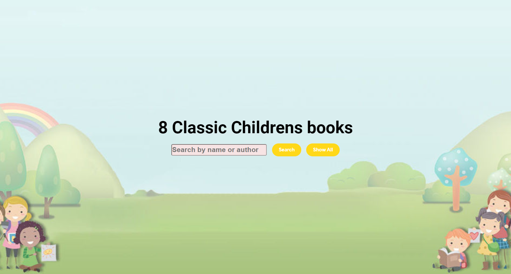
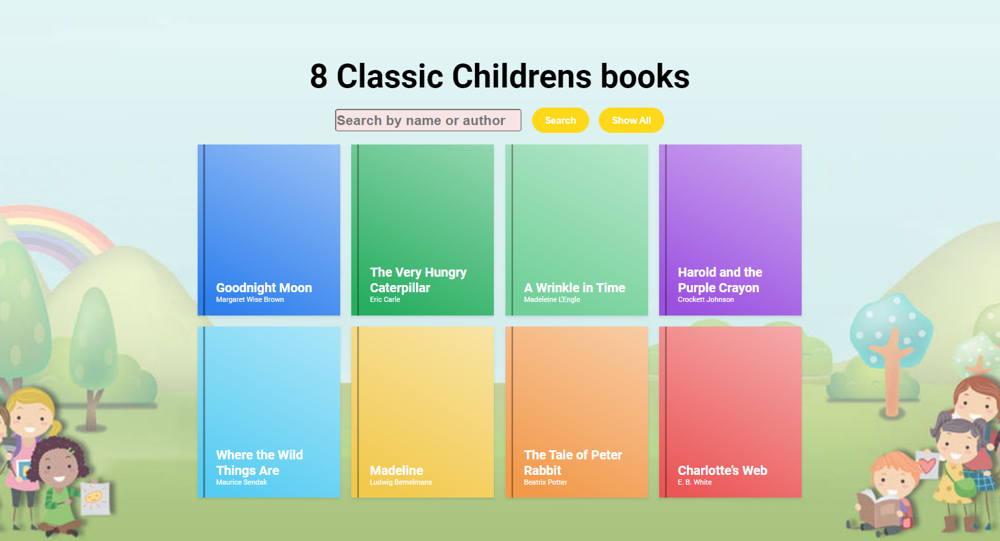
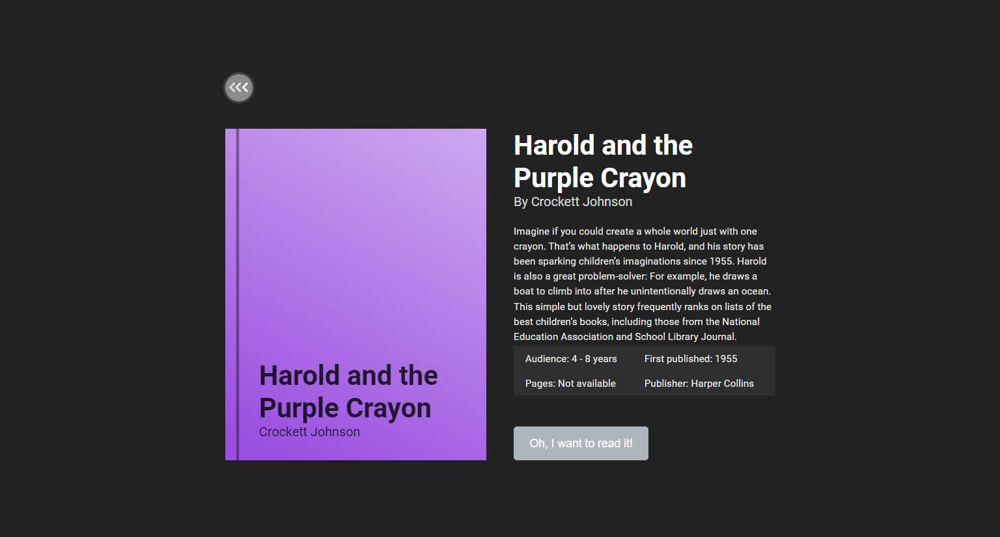

# Mini-Library

<--- Paulius Kamuntavicius HVE ts course individual project --->

8 Classic books for children

## Clone the repository
git clone https://github.com/ELSOLRA/Mini-Library

## Screenshots

### Main Page

### Overlay

